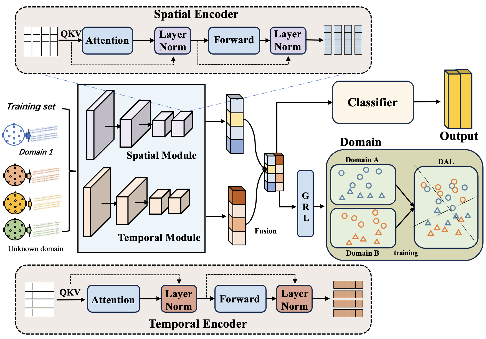

# A Domain Adversarial Learning Framework for Major Depression Disorder Diagnosis



## Introduction

* To the best of our knowledge, it is the first attempt to integrate transformer-based and Domain Adversarial Learning in a unified framework for MDD diagnosis. 
* item We apply Domain Adversarial Learning to extract subject-invariant features and further improve the generalization of the proposed model.
* item  The proposed MDD-DAL achieves the SOTA performance on MDD diagnosis datasets in subject-independent cross-validation.

### Key Challenges:
1. **Challenge 1**: [The inadequate consideration of spatial-temporal characteristics in EEG signals].
2. **Challenge 2**: [The cross-subject variability problem, also known as inter-subject variability.This refers to the fact that EEG signals can vary significantly across different individuals due to differences in brain morphology, neural connectivity, and other factors.].

This paper presents a new method for MDD diagnosis that effectively tackles the previously mentioned challenges. The proposed method relies on two principal modules: Spatial-Temporal Feature Learning module and the Domain Adversarial Learning module. The former uses spatial and temporal transformer blocks to capture spatial and temporal information from EEG signals, allowing the model to extract critical high-level features that aid in the diagnosis of MDD. The latter addresses the issue of cross-subject variability in EEG analysis by utilizing domain-labeled data and exhibiting increased generalization abilities toward new subjects while also improving robustness. .

## Requirements

To install and use this project, ensure that you have the following software and libraries installed:

- Python >= 3.8
- [Library 1] (e.g., `numpy>=1.19`)
- [Library 2] (e.g., `torch>=1.7`)
- [Additional dependencies]

You can install the required dependencies by running the following command:

```bash
pip install -r requirements.txt
```
##Datasets
- dataset/
    - train/
    - test/
    - validation/

##Usage
To train the model with the default settings, run the following command:
```bash
python train.py --config config.json
```

##Citation
@inproceedings{your_citation_key,
  title={Your Project Title},
  author={Your Name and Collaborator},
  booktitle={AAAI Conference on Artificial Intelligence},
  year={2024},
  pages={1234-1239},
}
